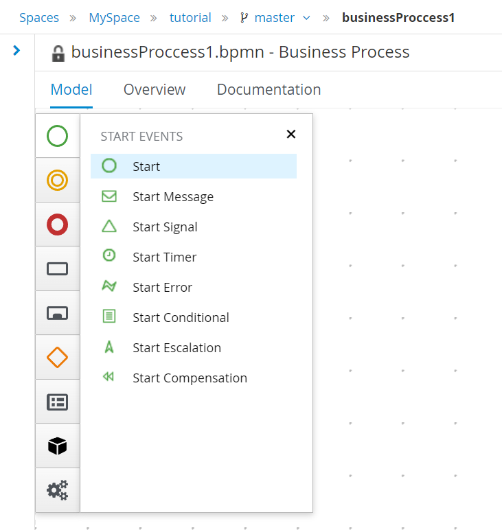
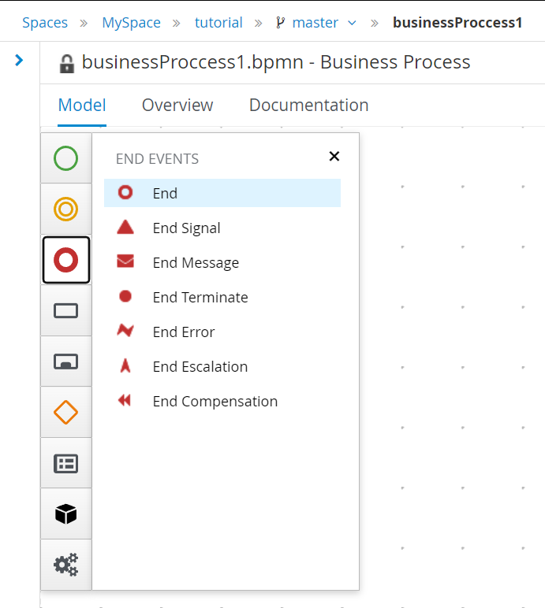
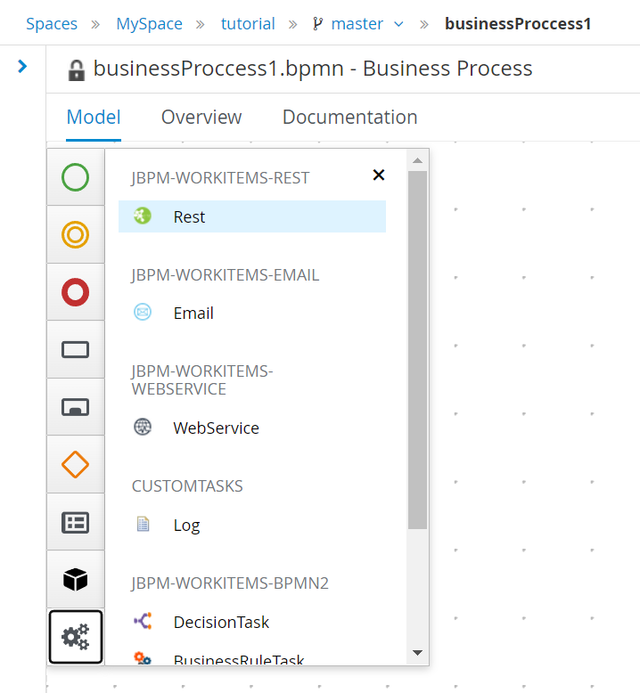
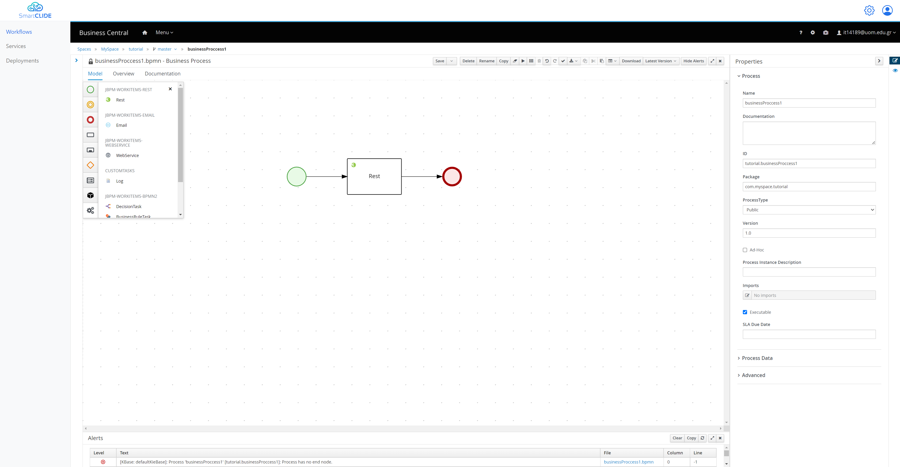
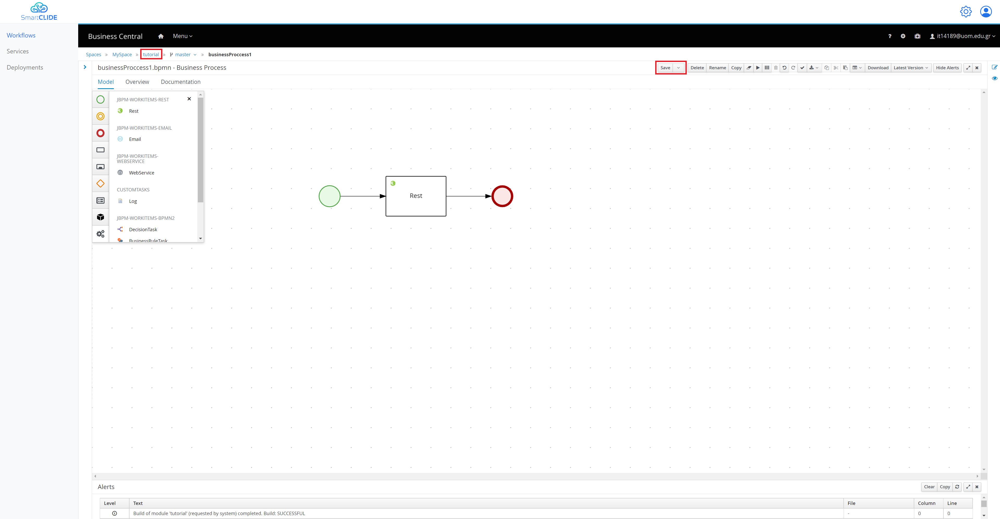
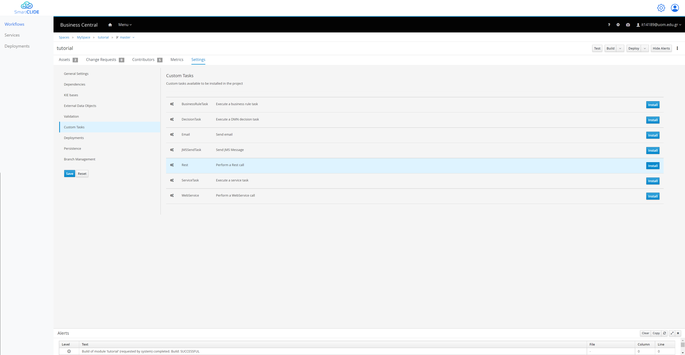
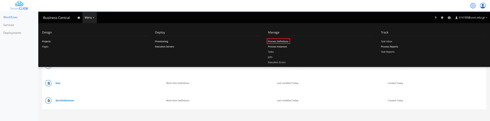
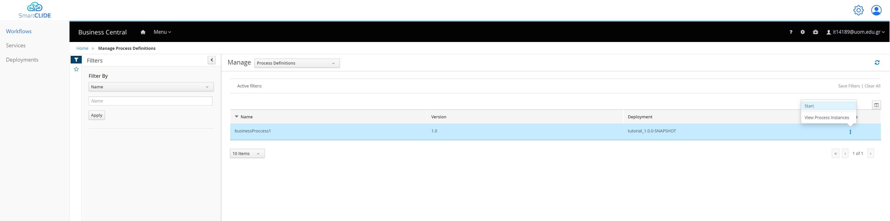
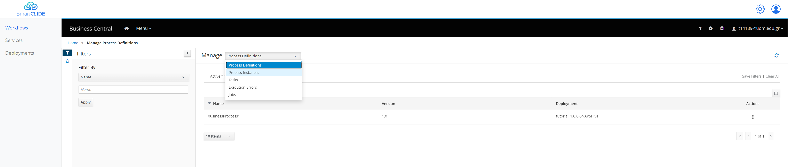
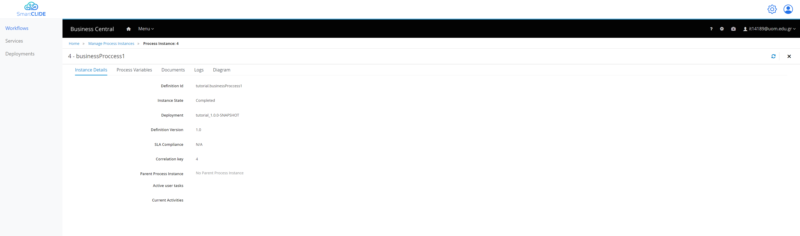

## Example 1
- ##### Design

|              Start Node               |              End Node               |
|:-------------------------------------:|:-----------------------------------:|
|  |  |

These first Nodes are necessary in order to provide the start and end of your workflow.
Moreover, for this example we are going to make a Rest API call, so we need to add a Rest node as well.

After having all the nodes in the editor we can start making the appropriate connections.
By selecting a node a lot of different options appear and from there you can select the arrow in order to connect this node with another one.
For this example that we want to make only one API call we have the following simple BPMN diagram.

In order to configure our Rest node in order to make the call to the API that we want, we can select it and change anything that we want from the right side of the editor.
The majority of the configuration exist inside the Data Assignments section.
By selecting the Assignments we are able to see and edit all the information regarding the Rest API call.

In the "Data Inputs and Assignments" section we can change for example
- The "Url" to "https://reqres.in/api/users"
- The "Method" to "GET"

In the "Data Outputs and Assignments" section we can make configurations regarding the output of the node.
In order to send the result of the call to the next node. But for this example we are not going to change anything.

In the "SmartCLIDE service discovery" section you can search for existing service, provided that you have a descriptive node Name, and Description.

If you don't find any appropriate service in the previous search you can use the "SmartCLIDE service creation".
That redirects you in the service creation page of SmartCLIDE.

Finally, the assignments are going to look like this:

- ##### Deploy
After the Design of the workflow, you can go ahead and select "Save".
It's the first button in the top bar above the editor.
Now by going back to the project (by selecting the name of the project from the top)

From here you have to add to install the Rest Task to your project since it not in the main components of jBPM.
You have to navigate to the "Settings" tab and from there select the "Custom Tasks" from the left side, and finally select "Install" for th Rest task.

So by navigating once again in the Assets Tab, you can see the Rest Asset as well.
And by selecting the "Deploy" button from the top right, the project is being build and deployed.

So now that our project is deployed if we want to create a process instance of our workflow, we navigate from the top menu to the "Process Definitions".

From here you are able to see all the processes, and you can start a new instance like this:

Now we can navigate to the Manage of "Process Instances" like this:

From here we see all the Process Instances that are active or have finished.
We can see that our Process Instance is finished since it had to do only an API call.
And if we select it, we can see more information about it.

