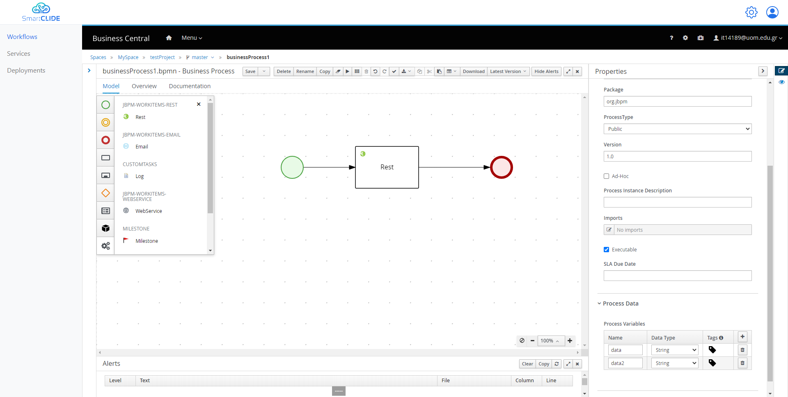
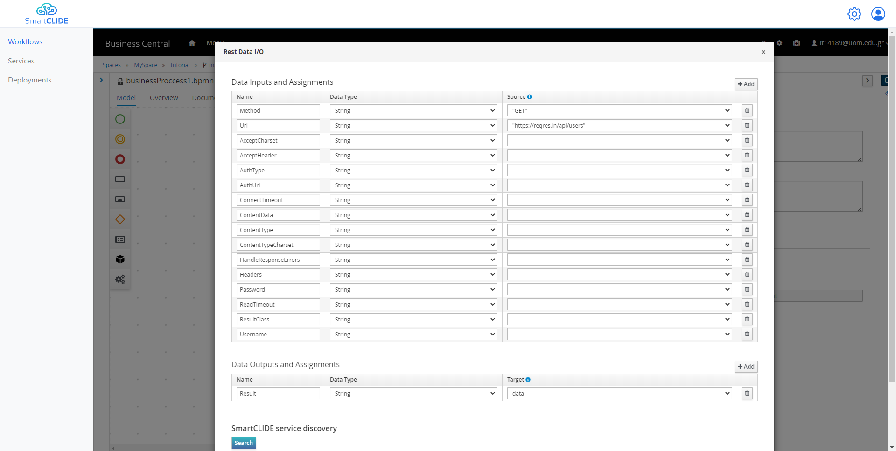
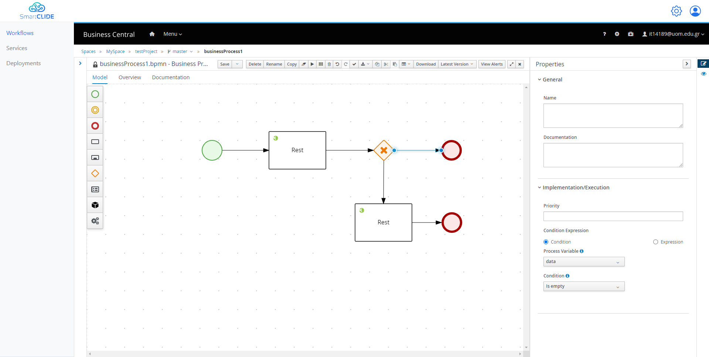
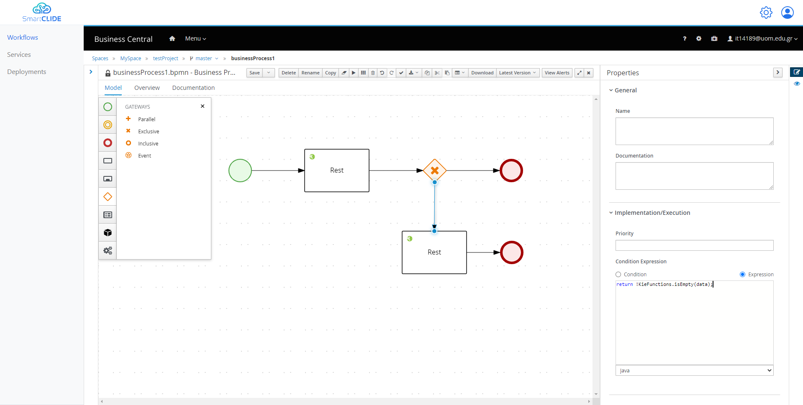
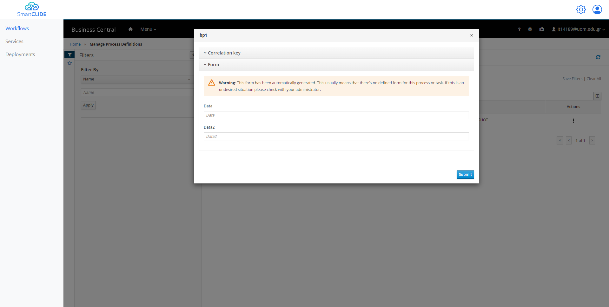
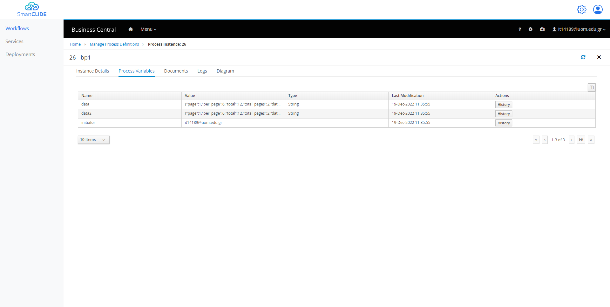

## Example 2

For this example we are going to create a more complex workflow, as an extension from the first example.

- ##### Design

First things first we are going to start from the previous workflow, and we are going to add 2 public variable.
This can be done from the properties of the projects (when nothing is selected from the diagram).
As it is visible from the following figure, you can add a new "Process Variable" in the "Process Data" section.
- A variable with name "data" and the type "String".
- A variable with name "data2" and the type "String".

So, after that we can use this variable in order to store our API request result.
By selecting the Rest Task, and navigating to the Assignments once again, in the "Data Outputs and Assignments" section we can do the following.
We can simply select our first public variable from the dropdown list from the "Target" column for the Results.
Like the following figure.

From there we can add an "Exclusive" Gateway, in order to check if the "data" variable is empty, and make another call or end the workflow accordingly.
The workflow is going to look like the following diagram.
In order to create the true-false value that the Gateway is going to use, we select the arrow that goes to the End and from the Implementation/Execution section we could add the following.
In the "Process Variable" we select the variable "data", and in the "Condition" we can select the "Is empty".

Also, in the arrow that goes to the second Rest Task we can add the opposite in the following way.

After that, in the second Rest Task like before we add the "Url", "Method", and in the output we could use the variable "data2".

- ##### Deploy

After these changes we can Save our workflow, and we deploy it like before.

By navigating once more to the "Process Definitions" in order to Start a new instance.
We don't provide any initial values to our variables, and we select "Submit".

And in the Tab "Process Variables" we can see that both of our variables were populated.
And in the Tab Diagram we can even see the Tasks that were executed.

