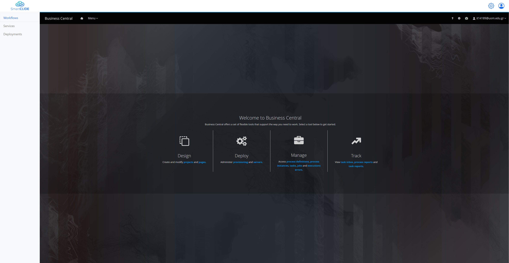
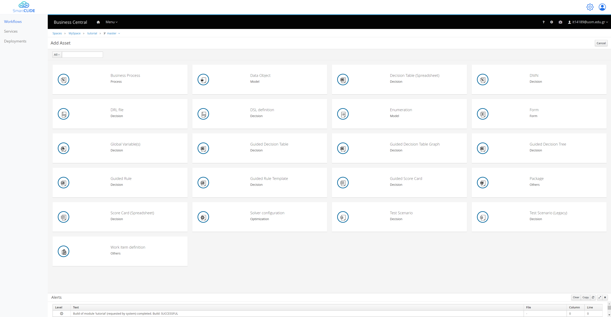
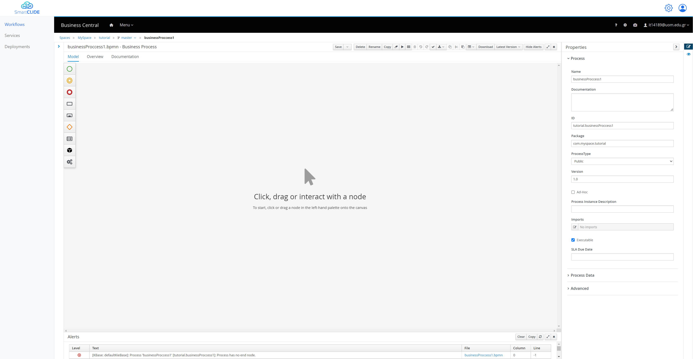
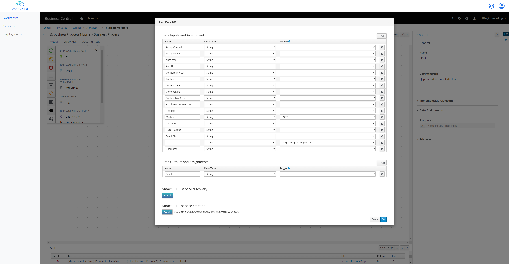
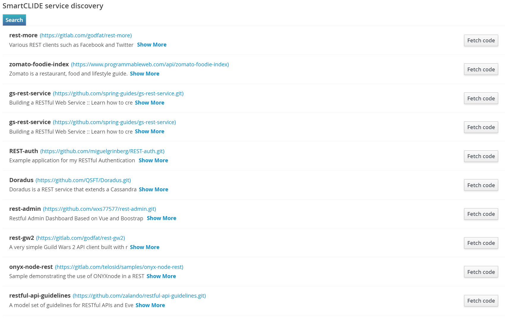
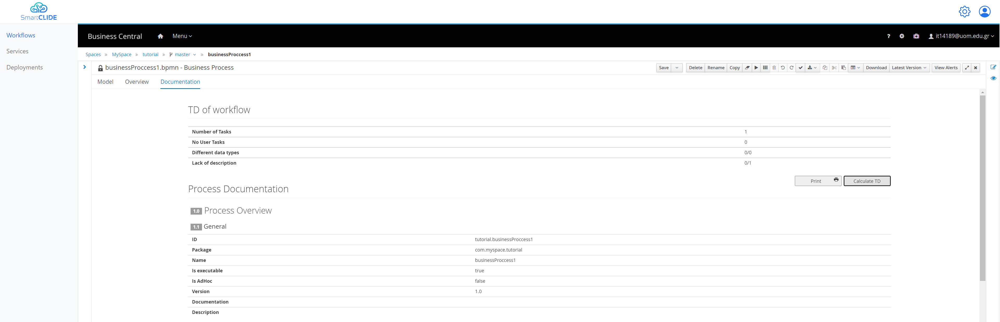

# Getting started with Workflows
In order to start creating your own workflows, you should head to the "Workflows" section from the left side of the SmarCLIDE IDE.
Once the page loads you will be able to see the jBPM instance inside the IDE, just like the following figure.

From here you can select the:
- "Design" in order to start creating and editing your BMPN diagrams/
- "Deploy" in order to see the deployment units.
- "Manage" in order to manage the process instances, tasks, or jobs.
- "Track" in order to see metrics and reports regarding your workflows.

## BPMN with SmartCLIDE
By selecting "Design" you are able to see your spaces, projects, and assets.
You can open/create a project and from there you can add different kind of Assets.

By selecting the "Business Process" asset, you will be promoted to add a name for this workflow, and after that an editor is going to open.

From here you will be able to start creating your BPMN diagrams.
The jBPM environment offers a lot of different nodes that can be added in the workflow, by simply drag and drop.
All these nodes exist on the left side of the editor.

## Main SmartCLIDE Additions

The main addition of SmartCLIDE is in the assignments section of each Rest Task, which looks like this.

As SmartCLIDE wants help the reuse of existing service, the "SmartCLIDE Service Discovery" section exist.
If the User provided a descriptive Task Name and Description, by simply selecting the "Search" button is able to get the appropriate results.
After that the user is able to select "Fetch Code", in order to get the according code in a Theia workspace in order to start the development process.

In case the user wasn't able to find a suitable existing service they can use the "Service Creation", in order to easily create a new one.

Moreover, another addition of SmartCLIDE is regarding the Technical Debt (TD) of the workflow.
In order to get the TD of the workflow, you have to navigate to the "Documentation" Tab of the workflow, and from there you select the "Calculate TD".

