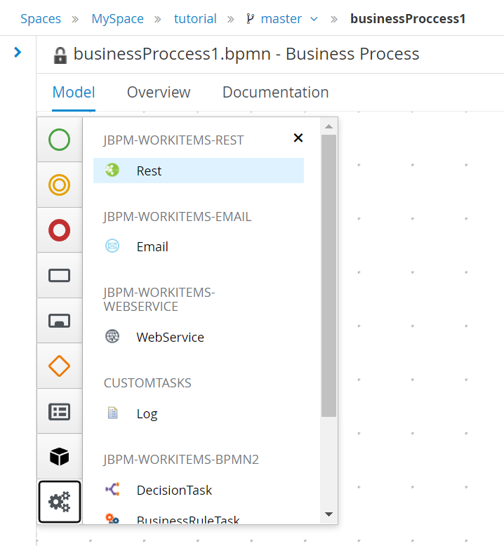
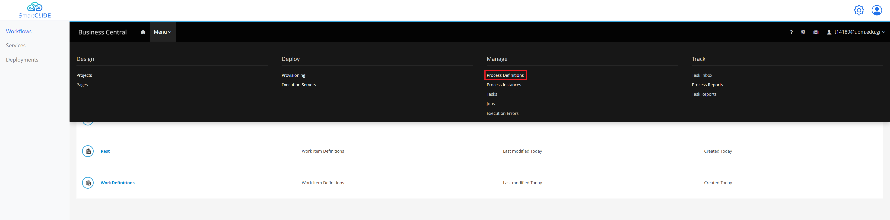
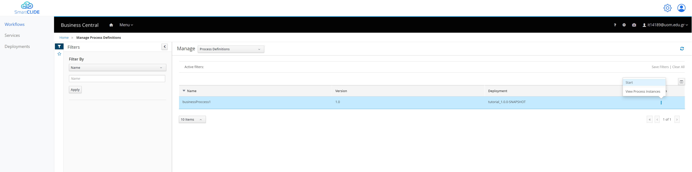
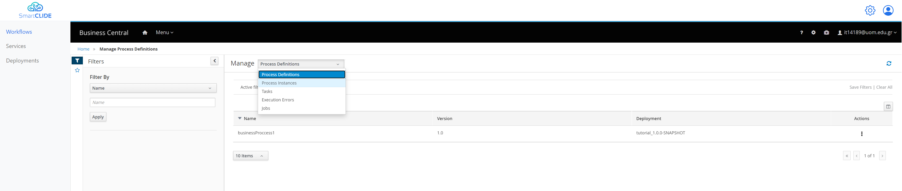
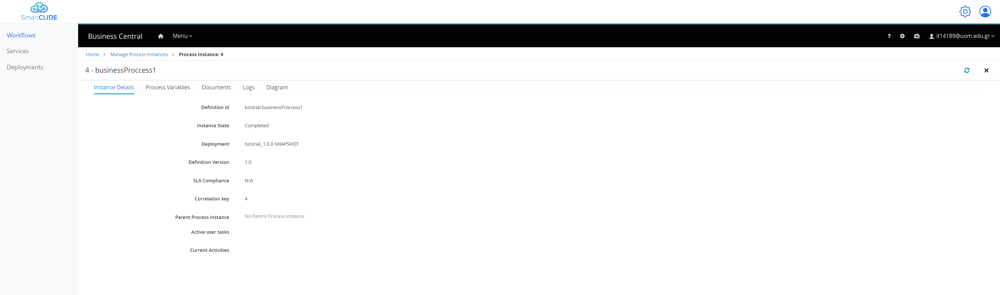
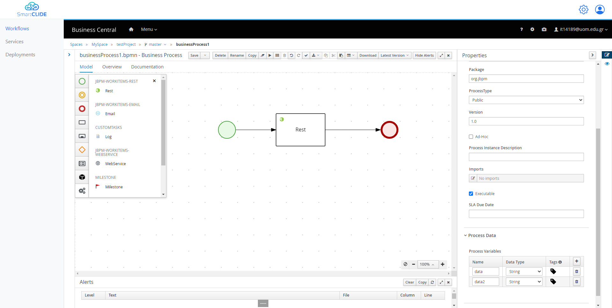

# Getting started
In order to start creating your own workflows, you should head to the "Workflows" section from the left side of the SmarCLIDE IDE.
Once the page loads you will be able to see the jBPM instance inside the IDE, just like the following figure.

From here you can select the:
- "Design" in order to start creating and editing your BMPN diagrams/
- "Deploy" in order to see the deployment units.
- "Manage" in order to manage the process instances, tasks, or jobs.
- "Track" in order to see metrics and reports regarding your workflows.

## BPMN with SmartCLIDE
By selecting "Design" you are able to see your spaces, projects, and assets.
You can open/create a project and from there you can add different kind of Assets.

By selecting the "Business Process" asset, you will be promoted to add a name for this workflow, and after that an editor is going to open.

From here you will be able to start creating your BPMN diagrams.
The jBPM environment offers a lot of different nodes that can be added in the workflow, by simply drag and drop.
All these nodes exist on the left side of the editor.

## Main SmartCLIDE Additions

The main addition of SmartCLIDE is in the assignments section of each Rest Task, which looks like this.

As SmartCLIDE wants help the reuse of existing service, the "SmartCLIDE Service Discovery" section exist.
If the User provided a descriptive Task Name and Description, by simply selecting the "Search" button is able to get the appropriate results.
After that the user is able to select "Fetch Code", in order to get the according code in a Theia workspace in order to start the development process.

In case the user wasn't able to find a suitable existing service they can use the "Service Creation", in order to easily create a new one.

Moreover, another addition of SmartCLIDE is regarding the Technical Debt (TD) of the workflow.
In order to get the TD of the workflow, you have to navigate to the "Documentation" Tab of the workflow, and from there you select the "Calculate TD".

## Example 1
- ##### Design

|              Start Node               |              End Node               |
|:-------------------------------------:|:-----------------------------------:|
|  |  |

These first Nodes are necessary in order to provide the start and end of your workflow.
Moreover, for this example we are going to make a Rest API call, so we need to add a Rest node as well.

After having all the nodes in the editor we can start making the appropriate connections.
By selecting a node a lot of different options appear and from there you can select the arrow in order to connect this node with another one.
For this example that we want to make only one API call we have the following simple BPMN diagram.

In order to configure our Rest node in order to make the call to the API that we want, we can select it and change anything that we want from the right side of the editor.
The majority of the configuration exist inside the Data Assignments section.
By selecting the Assignments we are able to see and edit all the information regarding the Rest API call.

In the "Data Inputs and Assignments" section we can change for example
- The "Url" to "https://reqres.in/api/users"
- The "Method" to "GET"

In the "Data Outputs and Assignments" section we can make configurations regarding the output of the node.
In order to send the result of the call to the next node. But for this example we are not going to change anything.

In the "SmartCLIDE service discovery" section you can search for existing service, provided that you have a descriptive node Name, and Description.

If you don't find any appropriate service in the previous search you can use the "SmartCLIDE service creation".
That redirects you in the service creation page of SmartCLIDE.

Finally, the assignments are going to look like this:

- ##### Deploy
After the Design of the workflow, you can go ahead and select "Save".
It's the first button in the top bar above the editor.
Now by going back to the project (by selecting the name of the project from the top)

From here you have to add to install the Rest Task to your project since it not in the main components of jBPM.
You have to navigate to the "Settings" tab and from there select the "Custom Tasks" from the left side, and finally select "Install" for th Rest task.

So by navigating once again in the Assets Tab, you can see the Rest Asset as well.
And by selecting the "Deploy" button from the top right, the project is being build and deployed.

So now that our project is deployed if we want to create a process instance of our workflow, we navigate from the top menu to the "Process Definitions".

From here you are able to see all the processes, and you can start a new instance like this:

Now we can navigate to the Manage of "Process Instances" like this:

From here we see all the Process Instances that are active or have finished.
We can see that our Process Instance is finished since it had to do only an API call.
And if we select it, we can see more information about it.

## Example 2
For this example we are going to create a more complex workflow, as an extension from the first example.
- ##### Design
First things first we are going to start from the previous workflow, and we are going to add 2 public variable.
This can be done from the properties of the projects (when nothing is selected from the diagram).
As it is visible from the following figure, you can add a new "Process Variable" in the "Process Data" section.
- A variable with name "data" and the type "String".
- A variable with name "data2" and the type "String".

So, after that we can use this variable in order to store our API request result.
By selecting the Rest Task, and navigating to the Assignments once again, in the "Data Outputs and Assignments" section we can do the following.
We can simply select our first public variable from the dropdown list from the "Target" column for the Results.
Like the following figure.

From there we can add an "Exclusive" Gateway, in order to check if the "data" variable is empty, and make another call or end the workflow accordingly.
The workflow is going to look like the following diagram.
In order to create the true-false value that the Gateway is going to use, we select the arrow that goes to the End and from the Implementation/Execution section we could add the following.
In the "Process Variable" we select the variable "data", and in the "Condition" we can select the "Is empty".

Also, in the arrow that goes to the second Rest Task we can add the opposite in the following way.

After that, in the second Rest Task like before we add the "Url", "Method", and in the output we could use the variable "data2".

- ##### Deploy

After these changes we can Save our workflow, and we deploy it like before.

By navigating once more to the "Process Definitions" in order to Start a new instance.
We don't provide any initial values to our variables, and we select "Submit".

And in the Tab "Process Variables" we can see that both of our variables were populated.
And in the Tab Diagram we can even see the Tasks that were executed.

